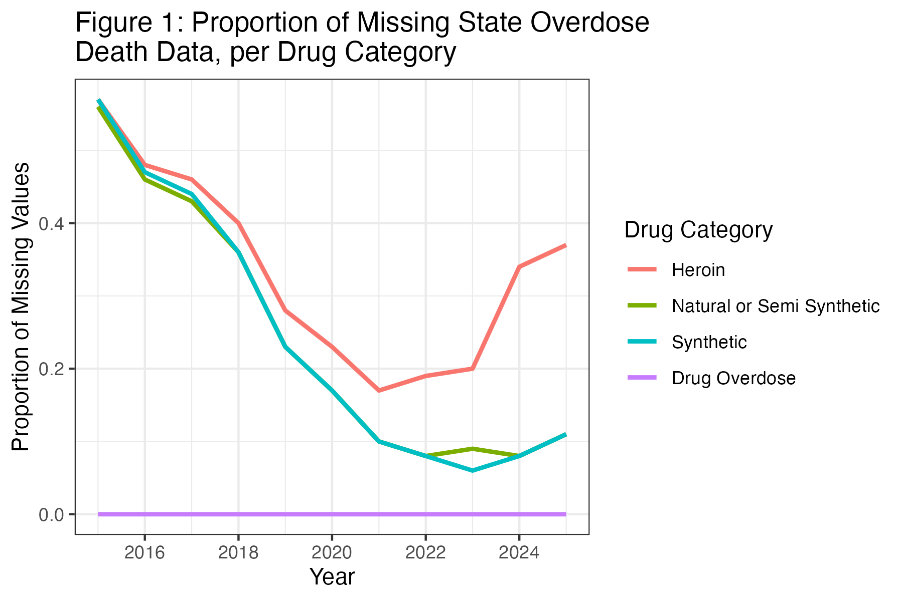

# 👋 INTRODUCTION

## United States Drug Overdose Crisis

::::: {.columns style="display: flex;"}
::: {.column width="70%" style="font-size:60%;"}
-   Since 1990s, rising drug overdose deaths have been associated with the **opioid overdose epidemic**
-   **Opioids**:
    -   Substances that block body's pain signal
    -   Subject to misuse/abuse
    -   Decrease respiration and lead to death by oxygen deprivation
-   **Recent Trend \[2013-Present\]:** Emergence of fentanyl, an extremely potent synthetic opioid, on the illicit drug market
:::

::: {.column width="20%" style="display:flex; align-items:center; justify-content:center;"}
{width="80%"}
:::
:::::

## Research Objectives

-   **Primary Goal:** Study trends of **overall drug overdose deaths** and **synthetic opioid overdose deaths** (from 2015 to 2025) at the national and state level
-   **Secondary Analysis:** Examine **specific US jurisdictions** with **unique drug overdose death trends**

# 🗂️ ABOUT THE DATA

## National Vital Statistics System (NVSS)

-   Inter-governmental system designed to share data on vital statistics *(births, deaths, etc)*
-   **Data:** NVSS drug overdose death counts from 2015 to 2025
    -   \# of deaths due to drug overdose that occurred in the 12-month period, ending of the month indicated
    -   **\[EXAMPLE\] January 2015 Data:** Reported \# of overdose deaths from January 2014 to January 2015

## Indicators for *Cause of Death*

1.  Synthetic Opioids

2.  Natural & Semi-Synthetic Opioids

3.  Heroin

4.  Overall Drug Overdose Deaths *\[to serve as a comparison\]*

## Missing Data (Cause of Death)

::::: columns
::: {.column width="50%"}
-   Reported drug overdose deaths counts *are often underestimated*, compared to true counts
-   Varied reporting policies for overdose cause in US states
-   Difficult toxicology testing to determine cause
:::

::: {.column width="50%"}
{width="100%"}
:::
:::::

# 📊 RESULTS

```{r, echo = FALSE, output = FALSE}
library(tidyverse)
library(readr)
library(lubridate)
library(plotly)
library(knitr)
library(tidyr)
library(DT)
library(htmltools)

opts_chunk$set(
  warning = FALSE,
  message = FALSE,
  eval=TRUE, ### SET THIS TO TRUE TO RUN ALL CODE ###
  echo = TRUE,
  cache=FALSE,
  include=TRUE,
  fig.width = 7, 
  fig.align = 'center',
  fig.asp = 0.618,
  out.width = "700px")

drug_deaths <- read.csv("VSRR_Provisional_Drug_Overdose_Death_Counts.csv")

drug_deaths <- drug_deaths %>% 
  select(c(1:6, 9)) %>% 
  mutate(Deaths = as.numeric(parse_number(Data.Value)),
         Date = my(paste(Month, Year, sep = ",")),
         State.Abb = State,
         State = State.Name) %>% 
  relocate(Month, .before = Year) %>% 
  relocate(Date, .after = Year) %>% 
  relocate(Deaths, .after = Indicator) %>% 
  relocate(State.Abb, .before = State)
drug_deaths$Data.Value <- NULL
drug_deaths$State.Name <- NULL

# Remove "Period" column because all values are the same
# table(drug_deaths$Period)
drug_deaths$Period <- NULL

# Look at "State.Name": Notice District of Columbia, Puerto Rico, United States, and New York City
table(drug_deaths$State) %>% 
  as.data.frame()

# The total death count for the United States does not include deaths occurring in Puerto Rico.
drug_deaths <- drug_deaths %>% 
  filter(!State == "Puerto Rico")

# Combine New York City and New York together:
new_york <- drug_deaths %>% 
  filter(State == "New York" | State == "New York City")
new_york$State <- NULL

new_york <- new_york %>% pivot_wider(names_from = State.Abb,
                                      values_from = Deaths) %>%
  mutate(Deaths = NY + YC)
new_york <- new_york %>% 
  select(Month, Year, Date, Indicator, Deaths) %>% 
  mutate(State.Abb = rep("NY", dim(new_york)[1]),
         State = rep("New York", dim(new_york)[1])) %>% 
  relocate(c(State.Abb, State), .before = Month) 

# Add in "New York" (state) values back to dataset
drug_deaths <- drug_deaths %>% 
  filter(State != "New York") %>% 
    filter(State != "New York City") 
drug_deaths <- rbind(drug_deaths, new_york)

# Filter to indicators of interest
drug_deaths <- drug_deaths %>% 
  filter(Indicator == "Heroin (T40.1)" | 
           Indicator == "Methadone (T40.3)" |
           Indicator == "Number of Drug Overdose Deaths" |
           Indicator == "Natural & semi-synthetic opioids (T40.2)" |
           Indicator == "Synthetic opioids, excl. methadone (T40.4)") %>% 
  mutate(Indicator = case_when(
    Indicator == "Heroin (T40.1)" ~ "Heroin",
    Indicator == "Methadone (T40.3)" ~ "Methadone",
    Indicator == "Number of Drug Overdose Deaths" ~ "Drug.Overdose",
    Indicator == "Natural & semi-synthetic opioids (T40.2)" ~ "Natural.SemiSynthetic",
    TRUE ~ "Synthetic"
  ))

drug_deaths$Indicator <- with(drug_deaths, 
                              factor(Indicator, 
                                     levels = c("Heroin", "Natural.SemiSynthetic",
                                                "Methadone", "Synthetic",
                                                "Drug.Overdose")))

drug_deaths <- drug_deaths %>% 
  pivot_wider(names_from = Indicator,
              values_from = Deaths)

# Population of 2010s
pop_2010s <- readxl::read_xlsx("pop_2010.xlsx")
pop_2010s <- pop_2010s %>% select(-2)
colnames(pop_2010s) <- c("State", seq(2010, 2020, 1))
pop_2010s <- pop_2010s[-c(1:3, 5:8, 60:67),]
pop_2010s$State <- gsub("\\.", "", pop_2010s$State)
pop_2010s <- pop_2010s %>% 
  mutate(across(`2010`:`2020`, as.numeric)) %>% 
  pivot_longer(cols = `2010`:`2020`,
    names_to = "Year",
    values_to = "Population")

# Population of 2020s
pop_2020s <- readxl::read_xlsx("pop_2020.xlsx")
pop_2020s <- pop_2020s %>% select(-c(2:3))
colnames(pop_2020s) <- c("State", seq(2021, 2025, 1))
pop_2020s <- pop_2020s[-c(1:3, 5:8, 60:67),]
pop_2020s$State <- gsub("\\.", "", pop_2020s$State)
pop_2020s <- pop_2020s %>% 
  mutate(across(`2021`:`2025`, as.numeric)) %>% 
  pivot_longer(cols = `2021`:`2025`,
    names_to = "Year",
    values_to = "Population")

pop <- rbind(pop_2010s, pop_2020s) %>% 
  mutate(Year = as.numeric(Year))

# Adding Population to drug_deaths
drug_deaths <- left_join(drug_deaths, pop, 
          by = c("State", "Year"))

# Creating "drugdeathper100k"
drug_deaths <- drug_deaths %>% 
  mutate(drugdeathper100k = round((Drug.Overdose/Population)*100000)) %>% 
  mutate(syntheticdeathper100k = round((Synthetic/Population)*100000))

# Split into National vs State-Level Datasets
drug_deaths_nat <- drug_deaths %>% filter(State.Abb == "US")
drug_deaths_state <- drug_deaths %>% filter(State.Abb != "US")

```

------------------------------------------------------------------------

## National Trends

::::: {.columns style="display: flex;"}
::: {.column width="85%"}
```{r, echo = FALSE}
nat_trends <- drug_deaths_nat %>% 
  plot_ly(x = ~Date, y = ~Drug.Overdose,
          type = "bar",
          marker = list(color = "black"),
          customdata = ~paste(Month, Year),
          hovertemplate = paste(
      "Drug Overdose\nDeaths: %{y:.2f}<br>",
      "<extra></extra>"),
          name = "All Drugs") %>% 
  ## SYNETHIC
   add_trace(x = ~Date, y = ~Synthetic, 
            type = "scatter", mode = "lines",
            line = list(color = "lightblue"),
            marker = list(color = "lightblue"),
            customdata = ~paste(Month, Year),
            hovertemplate = paste(
      "Synthetic Opioid\nOverdose Deaths: %{y:.2f}<br>",
      "<extra></extra>"),
            name = "Synthetic Opioids") %>% 
  ## NATURAL AND SEMI-SYNTHETIC
  add_trace(x = ~Date, y = ~Natural.SemiSynthetic, 
            type = "scatter", mode = "lines",
            line = list(color = "pink"),
            marker = list(color = "pink"),
            customdata = ~paste(Month, Year),
            hovertemplate = paste(
      "Natural and Semi-Synthetic\nOpioid Overdose Deaths: %{y:.2f}<br>",
      "<extra></extra>"),
            name = "Natural & Semi-Synthetic\nOpioids") %>% 
  ## HEROIN
  add_trace(x = ~Date, y = ~Heroin, 
            type = "scatter", mode = "lines",
            line = list(color = "lightgreen"),
            marker = list(color = "lightgreen"),
            customdata = ~paste(Month, Year),
            hovertemplate = paste(
      "Heroin Overdose\nDeaths: %{y:.2f}<br>",
      "<extra></extra>"),
            name = "Heroin") %>% 
  layout(hovermode = "x unified",
    hoverlabel = list(
    align = "left",
    bgcolor = "white",
    font = list(size = 10)),
    xaxis = list(hoverformat = "<b> 12 Month-Ending Period: %B %Y </b>"),
    yaxis = list(title = "Deaths"),
         title = "Figure 1: 12 Month-Ending Reported Drug Overdose Deaths\nin the United States, from January 2015 to October 2025",
         margin = list(l = 40, r = 40, t = 140, b = 60))
nat_trends
```
:::

::: {.column width="15%" style="font-size: 60%; display: flex; align-items: center; justify-content: center;"}
-   Largest proportion of 12-month ending reported overdose deaths are from **synthetic opioid overdoses** (2016–present)
-   **Overall & Synthetic Overdoses:** sharp increase from 2019–2023, followed by a decrease from 2023–2025
:::
:::::

------------------------------------------------------------------------

## State-Level Trends

```{r, echo = FALSE, fig.width=10, fig.height=10}
drug_deaths_heatmap <- drug_deaths_state %>% 
  select(State, Date, drugdeathper100k) %>% 
  pivot_wider(names_from = State,
              values_from = drugdeathper100k)
drug_deaths_heatmap <- as.data.frame(drug_deaths_heatmap)
rownames(drug_deaths_heatmap) <- drug_deaths_heatmap$Date
drug_deaths_heatmap$Date <- NULL
drug_deaths_heatmap <- as.matrix(drug_deaths_heatmap)


# Create a heatmap using plot_ly()
state_heatmap <- plot_ly(x=colnames(drug_deaths_heatmap), 
                         y=rownames(drug_deaths_heatmap),
             z=~drug_deaths_heatmap,
             type="heatmap",
        colorbar = list(title = "Drug Overdose Deaths\nper 100,000"),
             showscale=T,
        hovertemplate = paste(
    "<b> %{x} </b> <br>",
    "12 Month-Ending Period: %{y}<br>",
    "Deaths (per 100,000): %{z}<extra></extra>"),
          textposition = "none") %>% 
  layout(title = "Figure 2: 12 Month-Ending Reported Drug Overdose Deaths per 100,000\nin US States, from January 2015 to October 2025",
         margin = list(l = 40, r = 40, t = 140, b = 60))
state_heatmap
```

## State-Level Trends (2015 - 2025)

```{r, echo = FALSE, fig.width=8, fig.height=10}
percent_change <- drug_deaths %>% 
  filter(Date == "2015-01-01" | 
           Date == "2023-01-01" |
           Date == "2025-10-01") %>% 
  select(State, State.Abb, Year, drugdeathper100k) %>% 
  pivot_wider(names_from = Year,
              values_from = drugdeathper100k) 

colnames(percent_change) <- c("state_name", "state", 
                              "year2015", "year2023",
                              "year2025")

percent_change <- percent_change %>% 
  mutate(change_15_25 = round((100*(year2025 - year2015) / year2015), 2),
         change_15_23 = round((100*(year2023 - year2015) / year2015), 2),
         change_23_25 = round((100*(year2025 - year2023) / year2023), 2))

# Create hover text
percent_change$hover15_25 <- with(percent_change, 
                        paste("<b>", state_name, "</b>", '<br>',
                              '12 Month-Ending Deaths\nin January 2015 (per 100,000): ', year2015, '<br>', '<br>',
                              '12 Month-Ending Deaths\nin October 2025 (per 100,000): ', year2025,'<br>', '<br>',
                              "Percent Change: ", change_15_25, 
                              '%','<br>'))

percent_change$hover15_23 <- with(percent_change, 
                        paste("<b>", state_name, "</b>", '<br>',
                              '12 Month-Ending Deaths\nin January 2015 (per 100,000): ', year2015, '<br>', '<br>',
                              '12 Month-Ending Deaths\nin January 2023 (per 100,000): ', year2023,'<br>', '<br>',
                              "Percent Change: ", change_15_23, 
                              '%','<br>'))

percent_change$hover23_25 <- with(percent_change, 
                        paste("<b>", state_name, "</b>", '<br>',
                              '12 Month-Ending Deaths\nin January 2023 (per 100,000): ', year2023, '<br>', '<br>',
                              '12 Month-Ending Deaths\nin October 2025 (per 100,000): ', year2025,'<br>', '<br>',
                              "Percent Change: ", change_23_25, 
                              '%','<br>'))

# Set up mapping details
set_map_details <- list(
  scope = 'usa',
  projection = list(type = 'albers usa'),
  showlakes = TRUE,
  lakecolor = toRGB('white')
)

# Create plot
geo_15_25 <- plot_geo(percent_change, locationmode = 'USA-states') |> 
  add_trace(
    z = ~change_15_25, 
    text = ~hover15_25, 
    hovertemplate = "%{text}<extra></extra>",
    locations = ~state,
    color = ~change_15_25, 
    colors = 'Blues'
  ) %>% 
  colorbar(title = paste0("Percent Change (%)"), 
                       limits = c(-60,250)) %>% 
  layout(
    title = "Figure 3: Percent Change in 12 Month-Ending Drug Overdose Deaths\n(per 100,000) in US States, comparing January 2015 and October 2025",
    margin = list(l = 40, r = 40, t = 140, b = 60),
    geo = set_map_details
  )

geo_15_25
```

## State-Level Trends (2015 - 2023)

```{r, echo = FALSE, fig.width=8, fig.height=10}
geo_15_23 <- plot_geo(percent_change, locationmode = 'USA-states') |> 
  add_trace(
    z = ~change_15_23, 
    text = ~hover15_23, 
    hovertemplate = "%{text}<extra></extra>",
    locations = ~state,
    color = ~change_15_23, 
    colors = 'YlOrBr'
  ) %>% 
  colorbar(title = paste0("Percent Change (%)"), 
                       limits = c(-60,250)) %>% 
  layout(
    title = "Figure 4a: Percent Change in 12 Month-Ending Drug Overdose Deaths\n(per 100,000) in US States, comparing January 2015 and January 2023",
    margin = list(l = 40, r = 40, t = 140, b = 60),
    geo = set_map_details
  )

geo_15_23
```

## State-Level Trends (2023 - 2025)

```{r, echo = FALSE, fig.width=8, fig.height=10}
geo_23_25 <- plot_geo(percent_change, locationmode = 'USA-states') |> 
  add_trace(
    z = ~change_23_25, 
    text = ~hover23_25, 
    hovertemplate = "%{text}<extra></extra>",
    locations = ~state,
    color = ~change_23_25,
    colors = "YlOrBr"
  ) %>% 
  colorbar(title = paste0("Percent Change (%)"), 
                       limits = c(-60,250)) %>% 
  layout(
    title = "Figure 4b: Percent Change in 12 Month-Ending Drug Overdose Deaths\n(per 100,000) in US States, comparing January 2023 and October 2025",
    margin = list(l = 40, r = 40, t = 140, b = 60),
    geo = set_map_details
  )

geo_23_25
```

## State-Specific Trends

-   **District of Columbia**: Highest reported count of 12 month-ending drug overdose deaths per 100,000

-   **Washington**: Greatest percent increase in 12 month-ending drug overdose deaths per 100,000 \[Jan 2015-Oct 2025\]

-   **Vermont**:

    -   Large increase in 12 month-ending overdose deaths per 100,000 \[Jan 2015-Jan 2023\]

    -   Large percent decrease \[Jan 2023-Oct 2025\]

## State-Specific Trends

```{r, echo = FALSE, fig.width=8, fig.height=10}
drug_states <- drug_deaths_state %>% 
  filter(State == "District of Columbia" |
           State == "Vermont" |
           State == "Washington") %>% 
  mutate(State = factor(State, levels = c(
    "District of Columbia", "Washington", "Vermont"
  )))

three_states <- drug_states %>%
  plot_ly(x = ~Date, y = ~drugdeathper100k,
          type = "scatter", mode = "lines",
          color = ~State,
          fill = ~State,
          text = with(drug_states, paste("<b>", State, "</b>", 
                                               "<br>",
                                             "Drug Overdose Deaths (per 100,000): ", 
                                             drugdeathper100k, 
                                             "<br>")),
            hovertemplate = "%{text}<extra></extra>",
          textposition = "none") %>% 
  layout( hovermode = "x unified",
    hoverlabel = list(
    align = "left",
    bgcolor = "white",
    font = list(size = 10)),
    xaxis = list(hoverformat = "<b> 12 Month-Ending Period: %B %Y </b>"),
    yaxis = list(title = "New Deaths per 100,000"),
         title = "Figure 5: 12 Month-Ending Reported Drug Overdose\nDeaths (per 100,000), from January 2015 to October 2025",
         margin = list(l = 80, r = 40, t = 140, b = 60))

three_states

```

## State-Specific Trends

```{r, echo = FALSE, fig.width=10, fig.height=10}
fig <- plot_ly()

states <- c("District of Columbia", "Washington", "Vermont")
state_colors <- c(
  "District of Columbia" = "#66c1a5",
  "Washington" = "#fb8d62",
  "Vermont" = "#8e9fca"
)

for (i in seq_along(states)) {
  state_data <- drug_states %>% filter(State == states[i])
  
  fig <- fig %>%
    
    # Bar trace
    add_trace(
      data = state_data,
      x = ~Date,
      y = ~drugdeathper100k,
      type = "bar",
      name = paste("Drug Overdose Deaths"),
      visible = ifelse(i == 1, TRUE, FALSE),
      marker = list(color = "black"),
      customdata = ~paste(Month, Year),
      hovertemplate = paste(
      "Drug Overdose\nDeaths per 100k: %{y:.2f}<br>",
      "<extra></extra>")
    ) %>%
    
    # Line trace
    add_trace(
      data = state_data,
      x = ~Date,
      y = ~(Synthetic/Population)*100000,
      type = "scatter",
      mode = "lines",
      name = paste("Synthetic Opioid\nOverdose Deaths"),
      visible = ifelse(i == 1, TRUE, FALSE),
      line = list(color = state_colors[state_data$State[1]]),
      marker = list(color = state_colors[state_data$State[1]]),
      customdata = ~paste(Month, Year),
      hovertemplate = paste(
      "Synthetic Opioid\nOverdose Deaths per 100k: %{y:.2f}<br>",
      "<extra></extra>")
    )
}

visibility_list <- lapply(seq_along(states), function(i) {
  vis <- rep(FALSE, length(states) * 2)
  vis[(2*i - 1):(2*i)] <- TRUE
  vis
})

fig <- fig %>%
  layout(
    hovermode = "x unified",
    hoverlabel = list(
      align = "left",
      bgcolor = "white",
      font = list(size = 10)),
    xaxis = list(hoverformat = "<b> 12 Month-Ending Period: %B %Y </b>"),
    title = list(
      text = paste0("Figure 6: 12 Month-Ending Reported Drug Overdose Deaths in\n", states[1], " (per 100,000), from January 2015 to October 2025"),  # initial title
      y = 0.87,
      yanchor = "top"
    ),
    yaxis = list(title = "Deaths per 100,000", range = c(0, 100)),
    updatemenus = list(
      list(
        type = "dropdown",
        active = 0,
        
        x = 1.41,
        y = 0.7,
        
        buttons = lapply(seq_along(states), function(i) {
          list(
            label = states[i],
            method = "update",
            args = list(
              list(visible = visibility_list[[i]]),
              list(title = list(
                text = paste0("Figure 6: 12 Month-Ending Reported Drug Overdose Deaths in\n", states[i], " (per 100,000), from January 2015 to October 2025"),
                y = 0.87,
                yanchor = "top"
                ))
              )
          )
        })
      )
    ),
    margin = list(l = 80, r = 40, t = 160, b = 60),
    legend = list(
      x = 1,
      y = 1
    )
  )
fig
```

# 📌 CONCLUSION

## Conclusions

-   Synthetic opioid overdose deaths were a large contributor to total overdose deaths in 12 month periods \[2016-Present\]

-   Overdose deaths from [all drugs]{.underline} & [synthetic opioids]{.underline} *in 12 month periods* increased from 2015 to 2023 (with a rapid increase from 2020-2023)

-   **State trends vary greatly**, but state-specific analysis revealed consistent **strong relationship between total overdose deaths and synthetic opioid overdose deaths**

## Conclusions (cont.)

-   **Limitations:**

    -   Missing data (related to NVSS data collection process)

    -   *Deaths in 12 month-ending periods*: Less intuitive "unit" of measurement

-   **Policies / Programs to Reduce Opioid Overdose:**

    -   **District of Columbia:** D.C. Stabilization Center

    -   **Vermont:** Medically assisted treatment programs

    -   **March 2023:** FDA approval of over-the-counter Naloxone (reverses overdose)

# ❓ QUESTIONS
